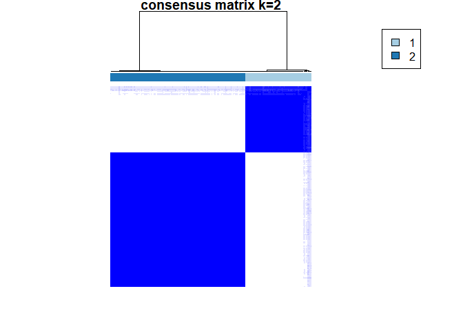

<!-- README.md is generated from README.Rmd. Please edit that file -->

# MMP

<!-- badges: start -->
<!-- badges: end -->

The goal of MMP is to conduct the multi-modalities radiomics phenotype
analysis, which mostly based on the MOVICS package.

## Installation

You can install the development version of MMP from
[GitHub](https://github.com/) with:

``` r
# install.packages("devtools")
devtools::install_github("yzhizai/MMP")
```

## Example

This is a basic example which shows you how to solve a common problem:

``` r
library(tidyverse)
#> Warning: package 'tidyverse' was built under R version 4.2.3
#> Warning: package 'ggplot2' was built under R version 4.2.3
#> Warning: package 'tibble' was built under R version 4.2.3
#> Warning: package 'tidyr' was built under R version 4.2.3
#> Warning: package 'readr' was built under R version 4.2.3
#> Warning: package 'purrr' was built under R version 4.2.3
#> Warning: package 'dplyr' was built under R version 4.2.3
#> Warning: package 'stringr' was built under R version 4.2.3
#> Warning: package 'forcats' was built under R version 4.2.3
#> Warning: package 'lubridate' was built under R version 4.2.3
#> ── Attaching core tidyverse packages ──────────────────────── tidyverse 2.0.0 ──
#> ✔ dplyr     1.1.4     ✔ readr     2.1.4
#> ✔ forcats   1.0.0     ✔ stringr   1.5.1
#> ✔ ggplot2   3.5.0     ✔ tibble    3.2.1
#> ✔ lubridate 1.9.3     ✔ tidyr     1.3.0
#> ✔ purrr     1.0.2     
#> ── Conflicts ────────────────────────────────────────── tidyverse_conflicts() ──
#> ✖ dplyr::filter() masks stats::filter()
#> ✖ dplyr::lag()    masks stats::lag()
#> ℹ Use the conflicted package (<http://conflicted.r-lib.org/>) to force all conflicts to become errors
library(MOVICS)
#> 
#> Registered S3 methods overwritten by 'treeio':
#>   method              from    
#>   MRCA.phylo          tidytree
#>   MRCA.treedata       tidytree
#>   Nnode.treedata      tidytree
#>   Ntip.treedata       tidytree
#>   ancestor.phylo      tidytree
#>   ancestor.treedata   tidytree
#>   child.phylo         tidytree
#>   child.treedata      tidytree
#>   full_join.phylo     tidytree
#>   full_join.treedata  tidytree
#>   groupClade.phylo    tidytree
#>   groupClade.treedata tidytree
#>   groupOTU.phylo      tidytree
#>   groupOTU.treedata   tidytree
#>   is.rooted.treedata  tidytree
#>   nodeid.phylo        tidytree
#>   nodeid.treedata     tidytree
#>   nodelab.phylo       tidytree
#>   nodelab.treedata    tidytree
#>   offspring.phylo     tidytree
#>   offspring.treedata  tidytree
#>   parent.phylo        tidytree
#>   parent.treedata     tidytree
#>   root.treedata       tidytree
#>   rootnode.phylo      tidytree
#>   sibling.phylo       tidytree
#> Registered S3 methods overwritten by 'ggpp':
#>   method                  from   
#>   heightDetails.titleGrob ggplot2
#>   widthDetails.titleGrob  ggplot2
library(umap)
#> Warning: package 'umap' was built under R version 4.2.3
library(class)
#> Warning: package 'class' was built under R version 4.2.3
library(MMP)

flist <- c('feature_static_all.csv',
           'feature_dynamic_all.csv')
src.info <- read_csv('data_from_source.csv')
#> Rows: 227 Columns: 1
#> ── Column specification ────────────────────────────────────────────────────────
#> Delimiter: ","
#> dbl (1): Source
#> 
#> ℹ Use `spec()` to retrieve the full column specification for this data.
#> ℹ Specify the column types or set `show_col_types = FALSE` to quiet this message.

dt.list.train <- getDatalist(flist, which(src.info$Source == 0))
#> Rows: 227 Columns: 54
#> ── Column specification ────────────────────────────────────────────────────────
#> Delimiter: ","
#> dbl (54): original_firstorder_10Percentile_P, original_firstorder_10Percenti...
#> 
#> ℹ Use `spec()` to retrieve the full column specification for this data.
#> ℹ Specify the column types or set `show_col_types = FALSE` to quiet this message.
#> Rows: 227 Columns: 306
#> ── Column specification ────────────────────────────────────────────────────────
#> Delimiter: ","
#> dbl (306): original_firstorder_10Percentile_Sum, original_firstorder_10Perce...
#> 
#> ℹ Use `spec()` to retrieve the full column specification for this data.
#> ℹ Specify the column types or set `show_col_types = FALSE` to quiet this message.
dt.list.test <- getDatalist(flist, which(src.info$Source == 1))
#> Rows: 227 Columns: 54
#> ── Column specification ────────────────────────────────────────────────────────
#> Delimiter: ","
#> dbl (54): original_firstorder_10Percentile_P, original_firstorder_10Percenti...
#> 
#> ℹ Use `spec()` to retrieve the full column specification for this data.
#> ℹ Specify the column types or set `show_col_types = FALSE` to quiet this message.
#> Rows: 227 Columns: 306
#> ── Column specification ────────────────────────────────────────────────────────
#> Delimiter: ","
#> dbl (306): original_firstorder_10Percentile_Sum, original_firstorder_10Perce...
#> 
#> ℹ Use `spec()` to retrieve the full column specification for this data.
#> ℹ Specify the column types or set `show_col_types = FALSE` to quiet this message.
# dimension reduction.
clust.data <- DR_umap(dt.list.train = dt.list.train, dt.list.test = dt.list.test)
#> Warning: failed creating initial embedding; using random embedding instead

# clustering analysis
cmoic.clust <- clust_identify(clust.data[[1]])
#> calculating Cluster Prediction Index...
#> 5% complete
#> 5% complete
#> 10% complete
#> 10% complete
#> 15% complete
#> 15% complete
#> 20% complete
#> 25% complete
#> 25% complete
#> 30% complete
#> 30% complete
#> 35% complete
#> 35% complete
#> 40% complete
#> 45% complete
#> 45% complete
#> 50% complete
#> 50% complete
#> 55% complete
#> 55% complete
#> 60% complete
#> 65% complete
#> 65% complete
#> 70% complete
#> 70% complete
#> 75% complete
#> 75% complete
#> 80% complete
#> 85% complete
#> 85% complete
#> 90% complete
#> 90% complete
#> 95% complete
#> 95% complete
#> 100% complete
#> calculating Gap-statistics...
#> visualization done...
#> --the imputed optimal cluster number is 8 arbitrarily, but it would be better referring to other priori knowledge.
#> --you choose more than 1 algorithm and all of them shall be run with parameters by default.
#> clustering done...
#> feature selection done...
#> iClusterBayes done...
#> SNF done...
#> Clustering method: kmeans
#> Perturbation method: noise
#> PINSPlus done...
#> NEMO done...
#> COCA done...
#> LRAcluster done...
#> end fraction
```


    #> clustered


    #> clustered



    #> ConsensusClustering done...
    #> IntNMF done...
    #> clustering done...
    #> feature selection done...
    #> CIMLR done...
    #> clustering done...
    #> feature selection done...
    #> MoCluster done...


``` r

# predict the cluster
test.pred <- knn_train_test(cmoic.clust,
               clust.data.train = clust.data[[1]],
               clust.data.test = clust.data[[2]])
src.info$Group <- 0
src.info$Group[src.info$Source == 0] <- cmoic.clust$clust.res$clust
src.info$Group[src.info$Source == 1] <- test.pred

out.clust <- data.frame(samID = paste0('subj', 1:length(test.pred)),
                    clust = test.pred)

write_csv(src.info, 'grp_info.csv')

out.clust.validation <- out.clust %>% slice(which(src.info$Source == 1)) %>%
  as.data.frame
rownames(out.clust.validation) <- out.clust.validation$samID

clust.data.2 <- clust.data[[2]]
draw_Heatmap(clust.data.2, out.clust.validation, fig.name = 'Heatmap')
```


